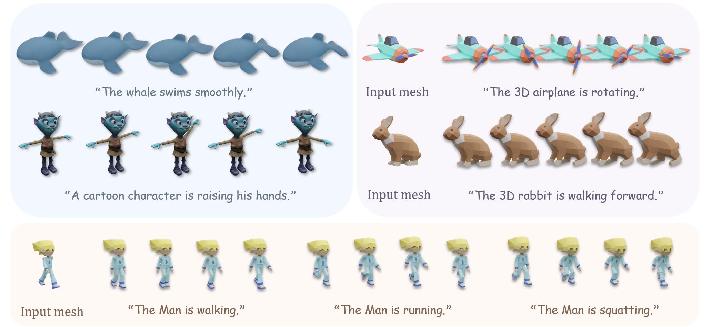

<h1 align="center">Direct Text-Driven 4D Generation with Structured<br> Latent Diffusion [ECCV 2026]</h1>
<p align="center"><a href='https://sugercanee.github.io/DiTex4D-Page/'></a>
</p>
<p align="center"></p>

Despite recent progress, direct text-driven 4D object generation remains challenging yet highly desirable. In this paper, we introduce DiTex4D, a native text-to-4D generation framework that enables both text-driven 4D generation from scratch and 3D animation from static mesh. Built upon large-scale pre-trained 3D generation models, our framework DiTex4D avoids intermediate text-to-video pipelines and costly per-object optimization. Specifically, <strong>(i)</strong> we achieve 4D spatiotemporal consistency via inflating 3D attention with mixed-4D RoPE and tailored correlated noise injection strategy. <strong>(ii)</strong> To enable 3D animation, we introduce a mask-based diffusion model conditioned on multi-view global context to maintain strict consistency with the initial frame. We further fine-tune the framework for 4D interpolation to synthesize high-frame-rate sequences with smoother motion. Extensive experiments demonstrate that DiTex4D can achieve higher-quality, semantically align-ed, and spatiotemporally coherent 4D object generation, surpassing most existing state-of-the-art text-to-4D generation methods.

## TODO

- [ ] Release 3D+text-to-4D model inference code and weights
- [ ] Release text-to-4D model inference code and weights

## Installation

```sh
git clone --recurse-submodules git@github.com:3dv-casia/DiTex4D.git
cd DiTex4D
./setup.sh --new-env --basic --xformers --flash-attn --diffoctreerast --spconv --mipgaussian --kaolin --nvdiffrast
```

Alternatively, you can follow the detailed installation guidance provided by [TRELLIS](https://github.com/microsoft/TRELLIS/tree/main?tab=readme-ov-file#-installation).

<!-- Usage -->
## Usage

We provide a minimal example to run text-to-4D pipeline:
...
